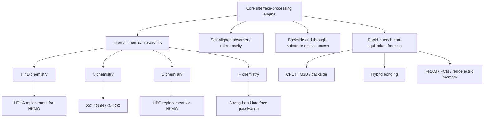

# Patent Portfolio Map

## Cools High-Pressure-Free Hydrogen Anneal and Chamber-Free Interface Processing

This document organizes the nineteen patent-specification axes presented in this repository into one technical and commercial architecture.

The common engine is:

```text
interface-adjacent internal reservoir
+ substrate-transmitted sub-bandgap light
+ self-aligned selective absorber
+ interface-localized thermal activation
+ rapid-quench non-equilibrium freezing
```

The first commercial proposition is the replacement and upgrading of High-Pressure Hydrogen Annealing (HPHA). The broader portfolio extends the same engine to oxygen, nitrogen and fluorine chemistry; wide-bandgap power devices; backside and three-dimensional integration; hybrid bonding; and emerging memory.

> Filing, priority, prosecution and national-phase status are managed separately. This public map describes technical scope and portfolio relationships, not legal status in a particular jurisdiction.

---

## 1. Platform hierarchy



---

# Layer A — Core chemistry and activation engines

## P01 — H/D buried-interface non-equilibrium passivation umbrella

**Title:** Non-Equilibrium Passivation of a Buried Interface Using an Internalized Hydrogen/Deuterium Reservoir, Sub-Bandgap Localized Photothermal Heating, and Rapid-Quench Freezing

**Core right:**

- internal H or D reservoir adjacent to a buried interface;
- substrate-transmitted sub-bandgap light;
- selective absorption near the interface;
- local mobilization of H/D to terminate dangling bonds;
- rapid freezing of Si–H or Si–D termination above the retention achievable by equivalent steady-state heating and slow cooling.

**Primary fingerprint:** localized H or D concentration peak at the buried interface; interfacial D/H ratio higher than adjacent bulk.

**Role:** hydrogen/deuterium genus and principal chemical basis for HPHA replacement.

---

## P02 — Nitrogen-reservoir non-equilibrium nitridation umbrella

**Title:** Non-Equilibrium Nitridation Passivation of an Interface Using an Internalized Nitrogen Reservoir, Sub-Bandgap Localized Photothermal Heating, and Rapid-Quench Freezing

**Core right:**

- internal nitrogen reservoir;
- selective interface-localized heating;
- nitridation of vacancies, dangling bonds and donor-like surface states;
- rapid-quench retention of localized nitrogen bonding.

**Representative chemistries:** Ga–N, Al–N, Ga–O–N, N–O and related nitrided interfaces.

**Representative applications:** GaN, AlGaN, AlN, InGaN, Ga₂O₃, silicon and diamond interfaces.

**Role:** nitrogen-chemistry umbrella across wide-bandgap and conventional semiconductor interfaces.

---

## P03 — Oxygen-reservoir oxidation and densification umbrella

**Title:** Non-Equilibrium Low-Thermal-Budget Oxidation and Densification of an Interface Using an Internalized Oxygen Reservoir, Sub-Bandgap Localized Photothermal Heating, and Rapid-Quench Freezing

**Core right:**

- internal oxygen reservoir;
- localized oxidation of suboxide bonds;
- oxygen-vacancy compensation;
- densification of interfacial and high-k oxide networks;
- quench freezing of a higher-density, more oxygen-localized state.

**Primary fingerprint:** interface-localized oxygen peak, reduced suboxide fraction, lower oxygen-vacancy concentration or higher oxide density.

**Role:** oxygen-chemistry umbrella and foundation for High-Pressure Oxidation (HPO) replacement.

---

## P04 — Fluorine strong-bond buried-interface passivation umbrella

**Title:** Fluorine Strong-Bond Buried-Interface Passivation of Semiconductor Devices

**Core right:**

- internal fluorine reservoir adjacent to a buried interface;
- local optical mobilization of F;
- formation of Si–F, C–F, Ga–F or related strong-bond termination;
- rapid-quench retention;
- controlled dose, peak temperature and dwell to suppress etching, corrosion and over-fluorination.

**Representative applications:** HKMG, SiC, GaN, hybrid-bond and other buried interfaces.

**Role:** strong-bond reliability extension beyond Si–H and Si–D chemistry.

---

## P05 — Backside-incidence interface-treatment engine

**Title:** Backside-Incidence Non-Equilibrium Interface Passivation Using Sub-Bandgap Light Transmitted Through a Semiconductor Substrate

**Core right:**

- backside incidence through a semiconductor substrate;
- treatment of frontside buried interfaces or backside interfaces after frontside device formation;
- low average temperature of frontside devices and wiring;
- H, D, N or O interface chemistry and rapid-quench freezing.

**Representative applications:** Backside-Illuminated (BSI) image sensors, Backside Power Delivery Networks (BSPDN), backside vias, Through-Silicon Vias (TSVs), three-dimensional integration and completed logic structures.

**Role:** optical-access umbrella that makes post-integration treatment possible.

---

## P06 — Self-aligned absorber–mirror cavity structure

**Title:** Semiconductor Structure Having a Self-Aligned Light-Absorbing Cavity Including a Sub-Bandgap Light Absorber and a Mirror Metal

**Core right:**

- selective absorber adjacent to a target interface;
- mirror metal behind the absorber;
- double-pass optical absorption;
- interface treatment trace laterally aligned with the absorber pattern;
- finished-device structural fingerprint independent of the process description.

**Representative absorbers:** gate metals, TiN, TaN, electrodes, pads, barriers, liners, doped semiconductor and conductive interface layers.

**Representative mirrors:** W, Cu, contacts, interconnects, opposing bonding pads or dedicated mirror metal.

**Role:** device-structure right and infringement-detection anchor for the full platform.

---

# Layer B — Internal deuterium reservoir structures

## P07 — Deuterium-loaded high-k dielectric reservoir

**Title:** Internal Reservoir Structure Including a Deuterium-Loaded High-k Dielectric Film

**Core right:**

- high-k dielectric containing stored deuterium;
- D/H ratio above natural abundance;
- interface-side concentration bias or gradient;
- later release and interface termination during localized optical heating.

**Representative materials:** HfO₂, ZrO₂, Al₂O₃, HfSiO, HfAlO and HfZrO.

**Role:** reservoir product right integrated directly into the gate dielectric.

---

## P08 — Deuterium-loaded silicon-nitride liner reservoir

**Title:** Internal Reservoir Structure Including a Deuterium-Loaded Silicon Nitride Liner Film

**Core right:**

- SiNx, SiCN or SiON liner loaded with D;
- use as passivation film, stress liner, contact-etch-stop layer or cap;
- Si–D and N–D storage;
- high-capacity local D supply to an adjacent interface.

**Role:** reservoir product right using a conventional high-volume device film with a new chemical-storage function.

---

# Layer C — HKMG logic: direct high-pressure-process replacement

## P09 — HPHA replacement for HKMG logic

**Title:** Manufacturing a High-k Metal-Gate Logic Device Using Chamber-Free Sub-Bandgap Passivation in Place of High-Pressure Hydrogen Annealing

**Core right:**

- replacement of all or part of HPHA;
- H/D reservoir inside or adjacent to the HKMG stack;
- backside sub-bandgap scan across multiple transistors;
- gate metal as absorber and BEOL/local interconnect as mirror;
- passivation before or after BEOL formation;
- localized H/D peaks below completed wiring.

**Representative devices:** planar FET, FinFET, Gate-All-Around nanosheet, nanowire, nanoribbon and CFET logic.

**Role:** principal market-facing application and direct HPHA replacement claim family.

---

## P10 — HPO replacement for HKMG logic

**Title:** Manufacturing a High-k Metal-Gate Logic Device Using Chamber-Free Sub-Bandgap Oxidation and Densification in Place of High-Pressure Oxidation

**Core right:**

- replacement of all or part of HPO;
- internal oxygen reservoir;
- backside scan and gate-metal absorption;
- suboxide oxidation, oxygen-vacancy correction and network densification;
- reduced gate leakage while limiting physical-thickness and EOT growth;
- treatment below completed interconnects.

**Role:** oxygen-side companion to the HPHA replacement family.

---

## P11 — HKMG nitrogen nitridation and mixed passivation

**Title:** Nitrogen Nitridation and Mixed Passivation of High-k Metal-Gate Interfaces

**Core right:**

- nitridation of the interfacial layer and/or high-k dielectric;
- formation of SiON, HfON, HfSiON or related nitrided material;
- suppression of impurity diffusion, EOT growth, high-k crystallization and grain-boundary leakage;
- Si–N channel-interface termination;
- N+H or N+F mixed/sequential treatment.

**Role:** multi-function HKMG interface engineering beyond single-species HPHA.

---

## P12 — HKMG fluorine strong-bond passivation

**Title:** Fluorine Strong-Bond Passivation of High-k Metal Gate Interfaces

**Core right:**

- occupation or stabilization of high-k oxygen-vacancy-related sites by F;
- Si–F termination of channel/interfacial-layer dangling bonds;
- border-trap termination and mitigation of Fermi-level pinning;
- rapid-quench retention with controlled over-reaction.

**Commercial targets:** NBTI, PBTI, threshold-voltage stability, leakage and high-k reliability.

**Role:** strong-bond reliability upgrade for advanced logic.

---

# Layer D — Wide-bandgap power-device applications

## P13 — SiC interface non-equilibrium nitridation

**Title:** Non-Equilibrium Nitridation Passivation of a Silicon Carbide Interface Using an Internalized Nitrogen Reservoir

**Core right:**

- nitrogen reservoir near the SiC/oxide interface;
- sub-bandgap light transmitted through SiC;
- gate metal or related absorber as local heater;
- nitrogen passivation of carbon clusters and carbon-related dangling bonds;
- rapid-quench retention of Si–N, C–N or Si–O–N bonding.

**Commercial target:** lower interface-state density, higher inversion-channel mobility and improved threshold stability without a long high-temperature NO/N₂O furnace anneal.

---

## P14 — H/D auxiliary passivation after SiC nitridation

**Title:** Auxiliary Passivation of a Silicon Carbide Interface Using a Hydrogen or Deuterium Reservoir and Sub-Bandgap Localized Photothermal Heating

**Core right:**

- first-pass nitrogen nitridation;
- second-pass H or D termination of residual traps;
- local reservoir release under sub-bandgap heating;
- retention of combined N and H/D concentration peaks.

**Role:** complementary chemistry family that addresses residual defects left after nitridation.

---

## P15 — SiC gate-oxide formation and densification

**Title:** Low-Thermal-Budget Formation and Densification of a Silicon Carbide Gate Oxide Using an Internalized Oxygen Reservoir

**Core right:**

- oxygen-reservoir-driven local formation or densification of SiC gate oxide;
- oxidation of suboxide bonds;
- removal of carbon through CO/CO₂-related pathways;
- oxidation of interface carbon clusters;
- quench freezing of the dense, low-carbon interface state.

**Commercial target:** lower interface carbon and Dit, higher mobility, improved breakdown and oxide reliability.

---

# Layer E — Three-dimensional, backside and bonding integration

## P16 — Upper-tier interface treatment in CFET and M3D

**Title:** Low-Temperature Treatment of an Upper-Tier Interface of a Three-Dimensional Stacked Device Using Sub-Bandgap Localized Photothermal Heating

**Core right:**

- treatment of an upper-tier gate, channel or passivation interface;
- chemical reservoir local to the upper tier;
- lower-tier preservation through optical transmission and thermal-diffusion confinement;
- H, D, N or O treatment under a limited lower-tier thermal budget.

**Representative platforms:** CFET, monolithic 3D integration, stacked nanosheet, nanowire, nanoribbon, oxide-semiconductor and SiGe-channel devices.

---

## P17 — Hybrid-bonding interface passivation and modification

**Title:** Non-Equilibrium Passivation or Modification of a Hybrid-Bonding Interface Using Sub-Bandgap Localized Photothermal Heating and Rapid-Quench Freezing

**Core right:**

- optical access through one bonded semiconductor structure;
- Cu pad, barrier, liner, cap or interface layer as absorber;
- opposing metal pad as mirror;
- local grain-boundary healing, grain bridging, void reduction and metal-bond strengthening;
- optional H/D/N/O passivation of dielectric or metal interfaces;
- reduced overlay disturbance compared with whole-stack furnace heating.

**Representative applications:** wafer-to-wafer, die-to-wafer, chiplet, image-sensor, 3D NAND/DRAM, logic-memory and HBM hybrid bonding.

---

# Layer F — Non-equilibrium memory-state and phase control

## P18 — HfO₂/HZO ferroelectric orthorhombic-phase freezing

**Title:** Locally Photothermally Heating a Hafnium-Oxide-Based Ferroelectric Film Using an Electrode Metal as a Self-Aligned Absorber and Freezing a Metastable Ferroelectric Orthorhombic Phase by Quenching

**Core right:**

- electrode metal as absorber and cap;
- local crystallization/annealing of HfO₂ or HZO;
- rapid freezing of the metastable ferroelectric orthorhombic phase;
- oxygen-vacancy distribution control;
- electrode-pattern-aligned phase fingerprint.

**Commercial targets:** FeRAM, FeFET and Ferroelectric Tunnel Junction (FTJ); reduced wake-up and imprint; improved remanent polarization and endurance.

---

## P19 — RRAM/PCM internal-state freezing

**Title:** Locally Photothermally Heating a Resistive-Switching or Phase-Change Memory Film Using an Electrode Metal as a Self-Aligned Absorber and Freezing a Resistance-Determining Internal State by Quenching

**Core right:**

- RRAM oxygen-vacancy or conductive-filament distribution control;
- PCM crystalline/amorphous phase setting;
- electrode or memory film as self-aligned absorber;
- rapid-quench internal-state freezing;
- protection of underlying logic and BEOL;
- electrode-aligned measurable state distribution.

**Commercial targets:** reduced forming or resistance variation, forming-assist/forming-free operation, phase initialization and lower resistance drift.

---

# 2. Cross-family claim matrix

| Axis | H/D | N | O | F | Local heat | Quench | Backside | Absorber/mirror | Final-device fingerprint |
|---|---:|---:|---:|---:|---:|---:|---:|---:|---:|
| Buried-interface umbrella | ✓ |  |  |  | ✓ | ✓ | optional | ✓ | ✓ |
| Nitridation umbrella |  | ✓ |  |  | ✓ | ✓ | optional | ✓ | ✓ |
| Oxidation umbrella |  |  | ✓ |  | ✓ | ✓ | optional | ✓ | ✓ |
| Fluorine umbrella |  |  |  | ✓ | ✓ | ✓ | optional | ✓ | ✓ |
| HPHA replacement | ✓ |  |  |  | ✓ | ✓ | ✓ | ✓ | ✓ |
| HPO replacement |  |  | ✓ |  | ✓ | ✓ | ✓ | ✓ | ✓ |
| HKMG N/mixed | ✓ | ✓ |  | ✓ | ✓ | ✓ | optional | ✓ | ✓ |
| HKMG F |  |  |  | ✓ | ✓ | ✓ | optional | ✓ | ✓ |
| SiC nitridation |  | ✓ |  |  | ✓ | ✓ | ✓ | ✓ | ✓ |
| SiC auxiliary passivation | ✓ | ✓ |  |  | ✓ | ✓ | optional | ✓ | ✓ |
| SiC oxide |  |  | ✓ |  | ✓ | ✓ | ✓ | ✓ | ✓ |
| 3D upper tier | ✓ | ✓ | ✓ |  | ✓ | ✓ | optional | ✓ | ✓ |
| Hybrid bonding | optional | optional | optional |  | ✓ | ✓ | ✓ | ✓ | ✓ |
| Ferroelectric memory |  |  | vacancy control |  | ✓ | ✓ | optional | ✓ | ✓ |
| RRAM/PCM |  |  | vacancy control |  | ✓ | ✓ | optional | ✓ | ✓ |

---

# 3. Common patent-defined engineering windows

The specifications describe representative, application-dependent ranges including:

- sub-bandgap wavelength: broadly about **0.8–3.0 μm**, with many silicon/SiC examples near **1.45–1.60 μm**;
- pulse duration: nanoseconds to microseconds or accumulated pulse trains, selected by the thermal-confinement requirement;
- interface peak temperature: chemistry-dependent, from hundreds of degrees Celsius for H/D/F treatment to higher local spikes for nitridation or oxidation;
- protected-region time-averaged temperature: commonly designed below approximately **300–500°C**, depending on device integration;
- rapid-quench rate: representative range **1 × 10⁸ to 1 × 10¹⁰ °C/s**;
- absorber-to-interface distance: broad nanometre-scale ranges, with narrow cavity embodiments near **1–3 nm**;
- chemical-species reservoir density: designed above the target defect, vacancy or unreacted-bond density.

These values are patent-described embodiments and design windows. They are not represented here as universal production specifications or validated results for every material stack.

---

# 4. Measurable infringement and validation fingerprints

The family is intentionally structured around detectable outcomes:

1. **depth-direction chemical peak** at the processed interface;
2. **lateral alignment** between the chemical/structural treatment trace and the absorber pattern;
3. **retained absorber–mirror cavity** in the finished device;
4. **D/H enrichment** at the target interface;
5. **localized nitrided, oxidized or fluorinated bonding**;
6. **reduced oxygen-vacancy, suboxide or carbon-cluster concentration**;
7. **electrode-aligned ferroelectric phase or memory-state distribution**;
8. **Cu grain bridging, lower void area or reduced contact resistance** at the bonded interface.

These fingerprints can be evaluated by SIMS/ToF-SIMS, XPS, EELS, FTIR, cross-sectional microscopy, local diffraction, electrical reliability structures and bonding-interface metrology.

---

# 5. Commercial licensing segmentation

The portfolio can be segmented without losing the common engine:

- **HPHA replacement license:** HKMG H/D passivation and backside scan;
- **HPO replacement license:** oxygen-reservoir oxidation and densification;
- **advanced-logic interface license:** H/D/N/F single- or mixed-chemistry processing;
- **power-device license:** SiC, GaN, AlGaN and Ga₂O₃ applications;
- **3D/backside license:** CFET, M3D, BSI, BSPDN and TSV;
- **hybrid-bond license:** Cu and dielectric interface modification;
- **memory license:** RRAM, PCM and HfO₂/HZO ferroelectric processing;
- **equipment license:** sub-bandgap source, scanning, thermal control, wafer handling and metrology integration.

---

# 6. Strategic summary

The narrow entry message is:

> **High-pressure hydrogen annealing without high pressure — upgraded with buried-interface selectivity and non-equilibrium freezing.**

The portfolio-level message is:

> **Move chemistry from the chamber into the device, move heat from the wafer to the interface, and freeze the result before it relaxes.**
