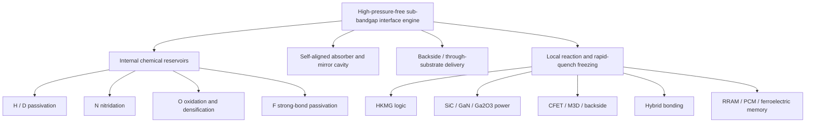

# Cools High-Pressure-Free Hydrogen Anneal

## Keep the hydrogen chemistry. Remove the pressure. Upgrade the interface physics.

> **Conventional high-pressure hydrogen annealing heats the wafer inside a pressurized chamber.**  
> **Cools stores hydrogen or deuterium next to the target interface, activates only that buried interface with substrate-transmitted sub-bandgap light, and rapidly freezes the passivated state before it relaxes.**

[한국어](README_KR.md) · [中文](README_ZH.md) · [Patent Portfolio](PATENT_PORTFOLIO.md)

---

## Executive proposition

The Cools platform is a patent-backed, high-pressure-free upgrade to High-Pressure Hydrogen Annealing (HPHA).

It does not merely remove the pressure vessel. It changes the process architecture:

1. **move the reactive chemistry from the chamber to an internal reservoir adjacent to the interface;**
2. **transmit sub-bandgap light through the semiconductor substrate or transparent tier;**
3. **use an existing gate, electrode, pad, liner or conductive layer as a self-aligned optical absorber;**
4. **heat only the buried interface while the wafer, lower devices and back-end interconnects remain at low average temperature;**
5. **mobilize H, D, N, O or F only across a short local distance;** and
6. **rapidly quench the interface to kinetically freeze the desired bond, composition, phase or internal state.**

```text
Internal chemical reservoir
→ substrate-transmitted sub-bandgap light
→ self-aligned absorption by existing device metal
→ buried-interface local thermal spike
→ short-range chemical-species mobilization
→ interface reaction or structural modification
→ rapid-quench non-equilibrium freezing
```

The primary market entry is **a high-pressure-free replacement and performance upgrade for HPHA in High-k Metal-Gate (HKMG) logic**. The same engine extends to high-pressure oxidation replacement, nitridation, fluorine strong-bond passivation, wide-bandgap power devices, three-dimensional integration, hybrid bonding and emerging memory.

---

## The industrial contradiction

HPHA and related high-pressure anneals solve an interface problem by exposing the entire wafer to a high-pressure, elevated-temperature environment.

That architecture creates four structural limitations:

- the reactive species must travel from the external chamber atmosphere to a deeply buried interface;
- the whole wafer and completed interconnect stack share the thermal budget;
- post-BEOL treatment is constrained by metal, low-k dielectric and overlay stability; and
- steady-state heating approaches the equilibrium limit of bond formation, desorption and species redistribution.

Cools reverses all four conditions.

| Conventional high-pressure anneal | Cools high-pressure-free upgrade |
|---|---|
| Chemistry supplied from an external high-pressure atmosphere | Chemistry preloaded in a film or layer next to the target interface |
| Whole-wafer heating | Buried-interface-selective local heating |
| Long diffusion path | Nanometre-scale local transport path |
| Furnace or pressure-chamber thermal budget | Low time-averaged temperature outside the target interface |
| Steady-state equilibrium process | Thermal-spike reaction followed by rapid-quench freezing |
| Treatment before sensitive BEOL integration | Backside or through-substrate treatment before or after BEOL |
| Blanket exposure | Gate-, electrode-, pad- or tier-self-aligned treatment |

> **The chamber is no longer the chemical source. The device itself carries the chemistry.**

---

## Core architecture

### 1. Internal H/D reservoir

Hydrogen or deuterium is preloaded into a high-k dielectric, silicon-nitride liner, cap, passivation film or other interface-adjacent layer. The stored species density is designed to exceed the density of dangling bonds or interface traps to be terminated.

Deuterium-loaded high-k and silicon-nitride films are independent structural rights in the portfolio. They convert an ordinary device film into a local chemical reservoir that can later release D only when and where the interface is optically heated.

### 2. Substrate-transmitted sub-bandgap light

The photon energy is selected below the relevant semiconductor absorption edge so that the beam passes through silicon, silicon carbide or another transmitting layer without significant band-to-band absorption.

Representative patent embodiments use approximately **1.45–1.60 μm** light for silicon- and SiC-based structures. The light may enter from the backside and scan across completed transistor arrays, buried interfaces or bonding structures.

### 3. Existing metal as a self-aligned absorber

A gate metal, work-function metal, electrode, contact, local interconnect, pad, liner, barrier or conductive device region absorbs the transmitted light and acts as the heater.

The treatment therefore follows the device pattern without an additional alignment mask:

```text
Metal pattern = optical absorber
Optical absorber = local heater
Local heater footprint = interface-treatment footprint
```

### 4. Self-aligned double-pass absorbing cavity

A second metal layer, interconnect or opposing bonding pad can act as a mirror. Light that passes through the absorber is reflected and passes through it again.

```text
substrate-transmitted light
→ absorber: first pass
→ mirror metal
→ absorber: second pass
→ enhanced interface-localized heating
```

The absorber, mirror and laterally aligned interface-treatment trace remain in the finished structure and provide a measurable physical fingerprint.

### 5. Local thermal confinement

The pulse duration is selected so that the thermal diffusion length does not reach the protected structure:

```text
L_th = √(D_th · τ) ≤ d_p
```

where `L_th` is the thermal diffusion length, `D_th` is thermal diffusivity, `τ` is the optical pulse duration and `d_p` is the distance to the protected region.

The interface may experience a short high-temperature spike while the wafer bulk, lower tier and BEOL maintain a much lower time-averaged temperature.

### 6. Rapid-quench non-equilibrium freezing

After the local reaction window, the interface is cooled through the formation window before the chemical species, phase or defect distribution can relax.

Representative patent conditions define:

```text
Q = ΔT / τ_cool
1 × 10^8 ≤ Q ≤ 1 × 10^10 °C/s
```

and constrain the effective diffusion during cooling so that the activated species remains localized within the target interface.

This is not simply rapid heating. The commercial differentiation is the full sequence:

> **store → transmit → absorb → react → quench → freeze**

---

## Primary product: HPHA replacement for HKMG logic

### Conventional objective

HPHA is used to terminate channel/gate-dielectric interface defects and improve threshold-voltage stability, mobility, hot-carrier reliability and bias-temperature reliability.

### Cools process

```text
Form HKMG transistor stack
→ retain or preload H/D in the high-k, liner or cap
→ optionally complete local interconnect and BEOL
→ illuminate from the substrate backside
→ TiN/TaN gate or adjacent metal selectively absorbs
→ W/Cu interconnect acts as mirror where available
→ channel/dielectric interface is locally heated
→ H/D terminates dangling bonds
→ rapid quench freezes Si–H or Si–D termination
```

### Why this is an upgrade, not only a replacement

- **No high-pressure chamber:** the required chemistry is already inside the device.
- **Buried-interface selectivity:** energy is deposited at the metal thermally coupled to the interface.
- **Post-BEOL compatibility:** sensitive interconnects remain at low average temperature.
- **Array-wide backside processing:** many transistors can be scanned without opening the frontside stack.
- **Deuterium option:** Si–D termination provides an isotope-based reliability path.
- **Beyond-equilibrium retention:** quenching suppresses thermally driven desorption and redistribution.
- **Measurable fingerprint:** H/D concentration peaks remain localized at the processed interface and align with the absorber pattern.

---

## Beyond HPHA: one engine, multiple interface chemistries

### Hydrogen and deuterium

- Si–H and Si–D termination of buried silicon interfaces
- deuterium-loaded high-k dielectric reservoirs
- deuterium-loaded silicon-nitride liner reservoirs
- post-nitridation H/D auxiliary passivation of SiC interfaces
- mixed and sequential chemical treatments

### Oxygen: high-pressure oxidation replacement

An internal oxygen reservoir is locally activated to:

- oxidize suboxide bonds;
- fill oxygen vacancies;
- densify an interfacial or high-k oxide network;
- reduce leakage while limiting physical-thickness and Equivalent Oxide Thickness (EOT) growth; and
- treat interfaces below completed interconnects.

### Nitrogen

Local nitridation can:

- terminate nitrogen vacancies and donor-like surface states in GaN, AlGaN and related wide-bandgap structures;
- form Si–N, C–N, Ga–N, Ga–O–N or Si–O–N bonding;
- suppress impurity diffusion and high-k crystallization; and
- passivate the SiC/oxide interface without a long high-temperature NO/N₂O furnace anneal.

### Fluorine

Fluorine reservoirs enable strong-bond passivation through Si–F, C–F or Ga–F termination and can occupy oxygen-vacancy-related sites in high-k dielectrics. The process is locally dose-, temperature- and dwell-controlled to avoid over-fluorination, etching or metal corrosion.

---

## Application platforms

### 1. Advanced logic

- planar FET, FinFET and Gate-All-Around (GAA) nanosheet logic
- Complementary Field-Effect Transistor (CFET)
- high-k interfacial-layer oxidation, densification, nitridation and H/D/F passivation
- treatment before or after local interconnect and BEOL

### 2. SiC, GaN and Ga₂O₃ power devices

- SiC/SiO₂ interface nitridation
- H/D auxiliary passivation after nitridation
- low-thermal-budget SiC gate-oxide formation and densification
- oxidation and removal of carbon-related interface residue
- GaN/AlGaN surface-state passivation to address current collapse and dynamic on-resistance
- Ga₂O₃ interface termination through nitrogen-, oxygen- or fluorine-related chemistry

### 3. Three-dimensional integration

- upper-tier interface treatment in monolithic 3D integration
- CFET upper-device treatment while preserving the lower tier
- backside treatment of buried frontside interfaces
- Backside Power Delivery Network (BSPDN), backside vias and Through-Silicon Via (TSV) interfaces
- Backside-Illuminated (BSI) image-sensor interface passivation

### 4. Hybrid bonding

Sub-bandgap light can pass through one bonded semiconductor structure and be absorbed at Cu pads, barriers, liners or interface absorbers. Local treatment can promote:

- Cu grain-boundary healing;
- grain bridging across the bonding interface;
- void reduction;
- recess or dishing compensation through local Cu expansion and diffusion;
- lower contact resistance; and
- stronger dielectric–dielectric bonding.

### 5. Emerging memory

- Resistive Random-Access Memory (RRAM): oxygen-vacancy and conductive-filament distribution control
- Phase-Change Memory (PCM): crystalline/amorphous state control by local heating and quench
- HfO₂/HZO ferroelectric memory: freezing of the metastable ferroelectric orthorhombic phase
- electrode-pattern-self-aligned internal-state control without whole-wafer thermal exposure

---

## Portfolio architecture



The detailed map of the nineteen disclosed patent-specification axes is provided in [PATENT_PORTFOLIO.md](PATENT_PORTFOLIO.md).

---

## Technical fingerprints

The portfolio is designed around process outcomes that can remain detectable in the finished device:

- a chemical-species concentration peak localized at the target buried interface;
- a higher D/H ratio at the interface than in adjacent bulk regions;
- lateral alignment of the treatment trace with the gate, electrode, pad or absorber pattern;
- an absorber–mirror double-pass cavity retained in the device stack;
- reduced oxygen-vacancy or suboxide concentration;
- localized nitrided or fluorinated bonding;
- electrode-aligned ferroelectric phase or memory-state distribution;
- Cu grain bridging, lower void fraction or reduced contact resistance at a hybrid-bond interface.

These structural and chemical fingerprints distinguish the platform from blanket furnace annealing or whole-wafer high-pressure treatment.

---

## Validation framework

The public portfolio describes patent-defined architectures, operating windows and engineering targets. Numerical examples in the specifications are design embodiments unless separately identified as experimentally validated data.

Priority validation modules include:

1. **optical/thermal:** transmission, absorber efficiency, mirror enhancement, interface peak temperature and protected-region average temperature;
2. **chemical:** Secondary-Ion Mass Spectrometry (SIMS), Time-of-Flight SIMS, X-ray Photoelectron Spectroscopy (XPS), Electron Energy-Loss Spectroscopy (EELS) and Fourier-Transform Infrared Spectroscopy (FTIR);
3. **electrical:** interface-state density, gate leakage, mobility, threshold-voltage hysteresis, NBTI/PBTI, hot-carrier reliability and dynamic on-resistance;
4. **structural:** oxide density, phase fraction, grain bridging, void fraction and interface morphology; and
5. **integration:** pre-BEOL/post-BEOL compatibility, lower-tier protection, wafer-scale scanning and throughput.

---

## Strategic position

The entry proposition is direct:

> **Replace high-pressure hydrogen annealing with a pressure-free, interface-selective, reservoir-fed and quench-frozen process.**

The longer-term platform is broader:

> **Replace external high-pressure chemistry and whole-wafer thermal exposure with internal chemistry and interface-only activation.**

This changes the competitive basis from chamber pressure and furnace uniformity to:

- reservoir engineering;
- optical transmission;
- self-aligned absorption;
- interface-scale thermal confinement;
- chemical-state and phase-state freezing; and
- post-integration accessibility.

---

## Collaboration and transaction paths

The portfolio can support:

- joint process development with logic, foundry, power-device, memory and advanced-packaging manufacturers;
- integration with laser, scanning, metrology and wafer-handling equipment platforms;
- field-limited or application-limited patent licensing;
- chemistry-specific licensing for H/D, N, O or F processing;
- device-specific licensing for HKMG, SiC, GaN, 3D integration, hybrid bonding or emerging memory; and
- evaluation through patterned test vehicles and interface-specific reliability structures.

---

## Notice

This repository is a public technical overview of a patent portfolio. It does not grant a license, disclose all process know-how or represent every numerical example as measured production data. Detailed recipes, integration conditions, reservoir-loading methods, optical-control parameters and validation data remain subject to separate technical and commercial arrangements.
