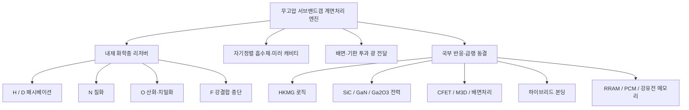

# Cools 무고압 수소 어닐 플랫폼

## 수소 화학은 유지하고, 압력은 제거하며, 계면처리는 업그레이드한다

> **기존 고압 수소 어닐은 가압 챔버 안에서 웨이퍼 전체를 가열합니다.**  
> **Cools는 수소 또는 중수소를 처리 계면 가까이에 미리 저장하고, 기판을 투과한 서브밴드갭 광으로 매립 계면만 활성화한 뒤, 형성된 패시베이션 상태가 풀리기 전에 급랭 동결합니다.**

[English](README.md) · [中文](README_ZH.md) · [특허 포트폴리오](PATENT_PORTFOLIO.md)

---

## 핵심 제안

Cools 플랫폼은 고압 수소 어닐(High-Pressure Hydrogen Annealing, HPHA)을 단순히 저가로 모방하는 기술이 아닙니다. **압력 제거에 계면 선택성, 배선 후 처리 가능성, 내부 화학종 리저버 및 비평형 동결을 더한 차세대 업그레이드**입니다.

공정 구조를 다음과 같이 바꿉니다.

1. 반응 화학종을 외부 챔버가 아니라 처리 계면 인접막에 저장한다.
2. 실리콘·탄화규소 등 반도체층을 투과하는 서브밴드갭 광을 사용한다.
3. 기존 게이트·전극·패드·라이너·배선을 자기정렬 흡수체 또는 미러로 사용한다.
4. 웨이퍼 전체가 아니라 매립 계면만 순간 가열한다.
5. 수소(H), 중수소(D), 질소(N), 산소(O), 불소(F)를 짧은 거리만 이동시킨다.
6. 반응 직후 급랭하여 결합·조성·상·내부상태를 비평형으로 동결한다.

```text
내재 화학종 리저버
→ 기판 투과 서브밴드갭 광
→ 기존 소자 금속의 자기정렬 흡수
→ 매립 계면 국부 열스파이크
→ 화학종의 단거리 동원
→ 계면 반응·패시베이션·개질
→ 급랭 비평형 동결
```

시장 진입점은 **고유전율 금속 게이트(High-k Metal Gate, HKMG) 로직에서 HPHA를 대체·고도화하는 무고압 공정**입니다. 동일 엔진은 고압 산화 대체, 질화, 불소 강결합 패시베이션, SiC·GaN 전력반도체, 3차원 적층, 하이브리드 본딩 및 이머징 메모리로 확장됩니다.

---

## 기존 고압 공정의 구조적 한계

기존 HPHA는 매립 계면의 결함을 해결하기 위해 웨이퍼 전체를 고압·고온 분위기에 노출합니다.

- 반응종이 외부 분위기에서 깊은 계면까지 장거리 확산해야 합니다.
- 이미 완성된 배선과 저유전율막까지 같은 열예산을 부담합니다.
- 배선 후 처리와 3차원 적층 상층 계면 처리가 제한됩니다.
- 정상상태 가열은 결합 형성·탈리·재배열의 평형 한계에 접근합니다.

Cools는 이 구조를 역전시킵니다.

| 기존 고압 어닐 | Cools 무고압 업그레이드 |
|---|---|
| 외부 고압 분위기에서 화학종 공급 | 계면 인접막에 화학종 사전 적재 |
| 웨이퍼 전체 가열 | 매립 계면 선택 가열 |
| 긴 확산거리 | 나노미터급 단거리 이동 |
| 챔버·노 열예산 | 표적 외 영역의 낮은 시간평균 온도 |
| 정상상태 평형처리 | 열스파이크 반응 후 급랭 동결 |
| 민감한 BEOL 형성 전 중심 | BEOL 전·후 및 배선 하부 처리 가능 |
| 전면 일괄 노출 | 게이트·전극·패드 패턴 자기정렬 |

> **이제 챔버가 화학종 공급원이 아닙니다. 소자 자체가 화학종을 보유합니다.**

---

## 공통 원천구조

### 1. 내재 수소·중수소 리저버

수소 또는 중수소를 고유전율막, 질화규소 라이너, 캡층, 패시베이션막 또는 계면 인접 유전체에 미리 적재합니다. 화학종 면밀도는 처리 대상 미결합손 또는 계면트랩 면밀도보다 크게 설계됩니다.

중수소 적재 고유전율막과 중수소 적재 질화규소 라이너는 각각 독립 구조 권리축입니다. 일반 소자막이 **처리 시점에만 D를 계면으로 공급하는 국부 리저버**로 바뀝니다.

### 2. 기판 투과 서브밴드갭 광

광자에너지를 반도체 흡수단보다 낮게 선택하여 기판을 통과시킵니다. 특허 실시형태에서는 실리콘 및 탄화규소 구조에 약 1.45–1.60 μm 파장을 적용합니다.

광은 배면에서 입사되어 완성된 트랜지스터 배열, 배선 하부 계면, 본딩 계면 또는 상층 티어를 스캔할 수 있습니다.

### 3. 기존 소자 금속의 자기정렬 발열

금속게이트, 일함수 금속, 전극, 콘택트, 로컬 인터커넥트, 패드, 배리어, 라이너 또는 도전성 영역이 광을 흡수해 히터로 기능합니다.

```text
금속 패턴 = 광 흡수체
광 흡수체 = 국부 히터
국부 히터의 범위 = 계면 처리 범위
```

별도 마스크 없이 소자 패턴에 자동 정렬됩니다.

### 4. 2회 통과 자기정렬 흡광 캐비티

흡수체 위의 텅스텐·구리 배선 또는 상대측 본딩 패드를 미러로 사용합니다. 흡수체를 통과한 광을 반사해 다시 통과시키므로 흡광 효율과 계면 가열 효율이 증가합니다.

흡수체·미러·계면 처리 흔적이 완성 소자에 남아 단면 분석 가능한 구조적 지문을 형성합니다.

### 5. 열확산 가둠

펄스 지속시간은 열확산 길이가 보호 대상까지 도달하지 않도록 설정합니다.

```text
L_th = √(D_th · τ) ≤ d_p
```

처리 계면은 짧은 고온 스파이크를 경험하지만, 웨이퍼 벌크·하층 티어·다층 배선은 훨씬 낮은 시간평균 온도로 유지됩니다.

### 6. 급랭 비평형 동결

반응 후 화학종과 결합상태가 탈리·재배열되기 전에 형성창을 급속 통과시킵니다.

```text
Q = ΔT / τ_cool
1 × 10^8 ≤ Q ≤ 1 × 10^10 °C/s
```

플랫폼의 차별성은 단순 레이저 가열이 아니라 다음 전체 사이클입니다.

> **저장 → 투과 → 흡수 → 반응 → 급랭 → 동결**

---

## 핵심 제품: HKMG 로직용 HPHA 대체

### 기존 목적

HPHA는 채널과 게이트 유전체 사이의 미결합손을 수소로 종단하여 계면결함, 문턱전압 불안정, 이동도 저하, 핫캐리어 열화 및 바이어스 온도 불안정성을 개선합니다.

### Cools 공정

```text
HKMG 게이트스택 형성
→ high-k·라이너·캡에 H/D 보유 또는 적재
→ 필요 시 로컬 인터커넥트·BEOL 형성
→ 기판 배면에서 서브밴드갭 광 입사
→ TiN/TaN 게이트 또는 인접 금속 선택 발열
→ W/Cu 배선은 미러로 작용
→ 채널/게이트 유전체 계면 국부 가열
→ H/D로 미결합손 종단
→ 급랭하여 Si–H 또는 Si–D 결합 동결
```

### 단순 대체가 아닌 이유

- 고압 챔버와 수소 압력 인프라가 필요하지 않습니다.
- 화학종을 계면 인근에 저장하므로 장거리 확산이 사라집니다.
- 다층 배선 하부의 계면도 배면 광으로 처리할 수 있습니다.
- 배선과 하부 소자는 낮은 시간평균 온도로 보호됩니다.
- 중수소를 사용하면 동위원소 기반의 장기 신뢰성 개선축이 추가됩니다.
- 급랭이 탈리·재배열을 억제하여 평형 공정과 다른 계면상태를 고정합니다.
- 처리 후 계면에는 H/D 농도 피크와 금속 패턴 정렬 지문이 남습니다.

---

## HPHA를 넘어서는 화학종 확장

### 수소·중수소

- 실리콘 매립 계면의 Si–H·Si–D 종단
- 중수소 적재 high-k 유전체 리저버
- 중수소 적재 SiNx 라이너 리저버
- SiC 질화 후 잔류결함의 H/D 보조 종단
- H→D 순차 치환과 혼합 처리

### 산소: 고압 산화(HPO) 대체

내재 산소 리저버를 국부 활성화하여:

- 서브옥사이드를 완전 산화하고,
- 산소공공을 보정하며,
- 계면층과 high-k 망목을 치밀화하고,
- 누설전류를 낮추면서 물리두께와 등가산화막두께 증가를 억제하고,
- BEOL 하부 계면을 처리합니다.

### 질소

- GaN·AlGaN의 질소공공과 도너성 표면상태 종단
- Ga₂O₃ 계면의 Ga–N 또는 Ga–O–N 결합 형성
- SiC/SiO₂ 계면의 탄소 관련 결함 질화
- HKMG 계면층의 SiON 형성과 불순물 확산 억제
- high-k 결정화 및 결정립계 누설 억제

### 불소

- Si–F, C–F, Ga–F 강결합 종단
- high-k 산소공공 및 보더트랩 점유
- NBTI·PBTI 및 문턱전압 안정성 개선
- 공급량·피크온도·누적 조사시간 제어에 의한 과불소화·식각·부식 방지

---

## 적용 플랫폼

### 첨단 로직

- 평면형 FET, FinFET, Gate-All-Around(GAA) 나노시트
- Complementary Field-Effect Transistor(CFET)
- HPHA 대체 H/D 패시베이션
- HPO 대체 산화·치밀화
- N·F 단독 또는 혼합 계면처리
- BEOL 형성 전·후 일괄 배면 스캔

### SiC·GaN·Ga₂O₃ 전력반도체

- SiC/SiO₂ 계면 질화
- 질화 후 H/D 보조 패시베이션
- SiC 게이트 산화막의 저열예산 형성·치밀화
- 계면 탄소 클러스터 산화 제거
- GaN/AlGaN 전류 붕괴 및 동적 온저항 개선
- Ga₂O₃ 계면의 N·O·F 기반 종단

### 3차원 적층과 배면처리

- Monolithic 3D(M3D) 상층 티어 계면처리
- CFET 상층 트랜지스터 처리와 하층 티어 보호
- Backside Power Delivery Network(BSPDN)
- Through-Silicon Via(TSV) 측벽 계면
- Backside-Illuminated(BSI) 이미지센서 배면 계면

### 하이브리드 본딩

- Cu 입계 치유와 그레인 브리징
- 보이드·계면저항 저감
- Cu 리세스·디싱 보상
- 유전체-유전체 결합 강화
- 상대측 Cu 패드를 미러로 이용한 본딩 계면 집중 가열

### 이머징 메모리

- Resistive Random-Access Memory(RRAM)의 산소공공·필라멘트 분포 동결
- Phase-Change Memory(PCM)의 결정질·비정질 상 제어
- HfO₂/HZO 강유전 직방정상 비평형 동결
- 전극 패턴 자기정렬 내부상태 형성

---

## 권리 구조



19개 특허 명세서축의 상세 관계는 [PATENT_PORTFOLIO.md](PATENT_PORTFOLIO.md)에 정리했습니다.

---

## 완성 소자에 남는 식별 지문

- 처리 계면에 국재화된 H·D·N·O·F 농도 피크
- 인접 벌크보다 높은 계면 D/H 비
- 게이트·전극·패드 패턴과 정렬된 처리 흔적
- 흡수체와 미러의 2회 통과 캐비티
- 산소공공·서브옥사이드·계면탄소 감소
- 질화 또는 불소 강결합 종단
- 전극 하부에 국재화된 강유전상·메모리 내부상태
- 하이브리드 본딩 계면의 그레인 브리징·보이드 저감·접촉저항 감소

이 지문은 전면 노 어닐 또는 웨이퍼 전체 고압처리와 구별되는 구조·화학적 증거가 됩니다.

---

## 검증 체계

공개 문서의 수치예는 별도로 실험 검증 데이터라고 표시된 경우를 제외하면 특허상 설계 실시형태 및 목표값입니다.

우선 검증항목은 다음입니다.

1. 광 투과율, 금속 흡수율, 미러 증폭, 계면 피크온도와 보호영역 평균온도
2. Secondary-Ion Mass Spectrometry(SIMS), Time-of-Flight SIMS, X-ray Photoelectron Spectroscopy(XPS), Electron Energy-Loss Spectroscopy(EELS), Fourier-Transform Infrared Spectroscopy(FTIR)에 의한 화학종·결합 분석
3. 계면상태밀도, 게이트 누설, 이동도, 문턱전압 히스테리시스, NBTI/PBTI, 핫캐리어, 동적 온저항
4. 산화막 밀도, 상분율, 본딩 입계·보이드·계면형상
5. BEOL 호환성, 하층 티어 보호, 웨이퍼 스캔 균일도와 처리량

---

## 전략적 위치

첫 시장 메시지는 명확합니다.

> **고압 수소 어닐을 무고압·계면선택·리저버공급·급랭동결 공정으로 교체한다.**

장기적으로는 더 큰 전환입니다.

> **외부 고압 화학과 웨이퍼 전체 열처리를, 소자 내부 화학과 계면 단독 활성화로 바꾼다.**

경쟁축은 챔버 압력과 노 균일도에서 다음으로 이동합니다.

- 화학종 리저버 설계
- 기판 투과 광학
- 기존 금속의 자기정렬 흡수
- 계면 규모 열가둠
- 결합·조성·상태의 급랭 동결
- 배선 이후 매립 계면 접근성

---

## 고지

본 저장소는 특허 포트폴리오의 공개 기술개요입니다. 본 공개는 라이선스를 부여하지 않으며 모든 공정 노하우를 공개하지 않습니다. 상세 리저버 적재법, 광학 제어조건, 통합 레시피, 장비구성 및 검증 데이터는 별도 기술·사업 협의 대상입니다.
