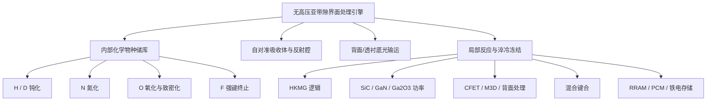

# Cools 无高压氢退火平台

## 保留氢化学，移除高压，并升级界面处理物理

> **传统高压氢退火在加压腔体内加热整个晶圆。**  
> **Cools 将氢或氘预先储存在目标界面附近，使亚带隙光穿透衬底并只激活埋藏界面，然后在钝化状态弛豫前快速淬冷冻结。**

[English](README.md) · [한국어](README_KR.md) · [专利组合](PATENT_PORTFOLIO.md)

---

## 核心主张

Cools 不是传统 High-Pressure Hydrogen Annealing（HPHA）的简单低成本替代方案，而是加入了以下能力的无高压升级平台：

1. 将反应化学物种从外部高压腔体转移到界面邻近的内部储库；
2. 使用可穿透硅、碳化硅或其他半导体层的亚带隙光；
3. 将现有栅极、电极、焊盘、衬层或互连金属作为自对准吸收体；
4. 只加热埋藏界面，使晶圆主体、下层器件和后段互连保持较低平均温度；
5. 仅在纳米尺度短距离内动员 H、D、N、O 或 F；
6. 通过快速淬冷冻结目标化学键、组成、相态或器件内部状态。

```text
内部化学物种储库
→ 衬底透射亚带隙光
→ 现有器件金属自对准吸收
→ 埋藏界面局部热脉冲
→ 化学物种短程迁移
→ 界面反应、钝化或改性
→ 快速淬冷非平衡冻结
```

首要市场入口是 **以无高压方式替代并升级高介电常数金属栅（HKMG）逻辑器件的 HPHA**。同一引擎还可扩展到高压氧化替代、氮化、氟强键钝化、宽禁带功率器件、三维集成、混合键合和新型存储器。

---

## 传统高压退火的结构性矛盾

传统 HPHA 通过将整个晶圆暴露于高压高温环境来解决一个局部埋藏界面问题，因此存在：

- 反应物种必须从外部气氛长距离扩散到深埋界面；
- 已完成的 BEOL 金属和低介电材料共同承担热预算；
- 后段互连完成后的处理受限；
- 稳态加热受制于成键、脱附和再分布的平衡极限。

Cools 反转了这些条件。

| 传统高压退火 | Cools 无高压升级 |
|---|---|
| 外部高压气氛供给化学物种 | 界面邻近薄膜预载化学物种 |
| 整片晶圆加热 | 埋藏界面选择性局部加热 |
| 长扩散路径 | 纳米尺度短程输运 |
| 腔体与炉体热预算 | 非目标区域保持低时间平均温度 |
| 稳态平衡处理 | 热脉冲反应后快速淬冷冻结 |
| 主要在敏感 BEOL 前处理 | 可在 BEOL 前后及互连下方处理 |
| 全面暴露 | 栅极、电极或焊盘图形自对准 |

> **高压腔体不再是化学源，器件本身携带所需化学物种。**

---

## 共用处理引擎

### 1. 内置 H/D 储库

氢或氘预装在 high-k 介质、氮化硅衬层、帽层、钝化层或界面邻近薄膜中。中子素负载的 high-k 介质和 SiNx 衬层分别构成独立结构权利轴。

### 2. 亚带隙光穿透衬底

选择低于半导体吸收边的光子能量，使光可穿过硅或 SiC。代表性实施方式采用约 1.45–1.60 μm 波长，并可从背面扫描已完成的晶体管阵列和埋藏界面。

### 3. 现有金属自对准发热

TiN、TaN、栅极、功函数金属、电极、接触、互连、焊盘、阻挡层或衬层吸收光并成为局部加热器。

```text
金属图形 = 光吸收体
光吸收体 = 局部加热器
加热器范围 = 界面处理范围
```

### 4. 双程吸光腔

W、Cu 互连或对侧键合焊盘作为反射镜，使光第二次通过吸收体，从而增强局部吸收和界面加热。

### 5. 热扩散约束

```text
L_th = √(D_th · τ) ≤ d_p
```

通过控制脉冲持续时间，使热扩散长度不达到需保护的器件、下层晶体管或 BEOL 区域。

### 6. 快速淬冷非平衡冻结

```text
Q = ΔT / τ_cool
1 × 10^8 ≤ Q ≤ 1 × 10^10 °C/s
```

完整差异化过程为：

> **储存 → 透射 → 吸收 → 反应 → 淬冷 → 冻结**

---

## 核心产品：HKMG 逻辑的 HPHA 替代

```text
形成 HKMG 栅叠层
→ 在 high-k、衬层或帽层中保留/装载 H 或 D
→ 可选择先完成局部互连和 BEOL
→ 从衬底背面入射亚带隙光
→ TiN/TaN 栅极或邻近金属选择吸收
→ W/Cu 互连作为反射镜
→ 局部加热沟道/栅介质界面
→ H/D 终止悬挂键
→ 淬冷冻结 Si–H 或 Si–D 键
```

该方案不仅取消高压，还增加：

- 埋藏界面选择性；
- 后 BEOL 处理能力；
- 背面阵列扫描；
- 氘同位素可靠性路径；
- 超越稳态平衡的键保持；
- 可通过界面 H/D 浓度峰和金属图形对准痕迹识别的结构指纹。

---

## 多化学物种扩展

### 氢与氘

- Si–H、Si–D 埋藏界面终止
- 氘负载 high-k 储库
- 氘负载 SiNx 衬层储库
- SiC 氮化后的 H/D 辅助钝化

### 氧：替代高压氧化

- 氧化亚氧化物键
- 补偿 high-k 氧空位
- 致密化界面层和介质网络
- 降低栅漏电并抑制 EOT 增长
- 处理 BEOL 下方界面

### 氮

- 钝化 GaN、AlGaN 的氮空位和施主型表面态
- 形成 Si–N、C–N、Ga–N、Ga–O–N 或 Si–O–N 键
- 抑制杂质扩散和 high-k 晶化
- 低热预算处理 SiC/SiO₂ 界面

### 氟

- 形成 Si–F、C–F、Ga–F 强键终止
- 占据 high-k 氧空位并终止边界陷阱
- 改善 NBTI、PBTI 和阈值电压稳定性

---

## 应用平台

### 先进逻辑

- 平面 FET、FinFET、Gate-All-Around（GAA）纳米片
- Complementary FET（CFET）
- HPHA 替代 H/D 钝化
- HPO 替代氧化与致密化
- N、F 单独或混合界面处理

### SiC、GaN、Ga₂O₃ 功率器件

- SiC/SiO₂ 界面氮化
- 氮化后的 H/D 辅助终止
- SiC 栅氧低热预算形成和致密化
- 界面碳团簇氧化去除
- GaN/AlGaN 电流崩塌和动态导通电阻改善

### 三维集成与背面处理

- Monolithic 3D 上层界面处理
- CFET 上层晶体管处理并保护下层器件
- Backside Power Delivery Network（BSPDN）
- Through-Silicon Via（TSV）侧壁界面
- Backside-Illuminated（BSI）图像传感器背面界面

### 混合键合

- Cu 晶界修复和跨界面晶粒桥接
- 空洞与接触电阻降低
- Cu 凹陷或碟形缺陷补偿
- 介质–介质键合增强

### 新型存储器

- RRAM 氧空位和导电细丝分布冻结
- PCM 晶态/非晶态控制
- HfO₂/HZO 亚稳正交铁电相冻结
- 电极图形自对准内部状态控制

---

## 权利结构



十九项专利说明书技术轴见 [PATENT_PORTFOLIO.md](PATENT_PORTFOLIO.md)。

---

## 战略定位

> **以无高压、界面选择、储库供给和淬冷冻结工艺替代高压氢退火。**

更广泛的平台目标是：

> **以器件内部化学和仅界面激活，替代外部高压化学和整片晶圆热暴露。**

---

## 声明

本仓库是专利组合的公开技术概述，不构成许可，也不披露全部工艺诀窍。具体储库装载方法、光学控制条件、集成配方、设备配置和验证数据需另行技术与商业协商。
